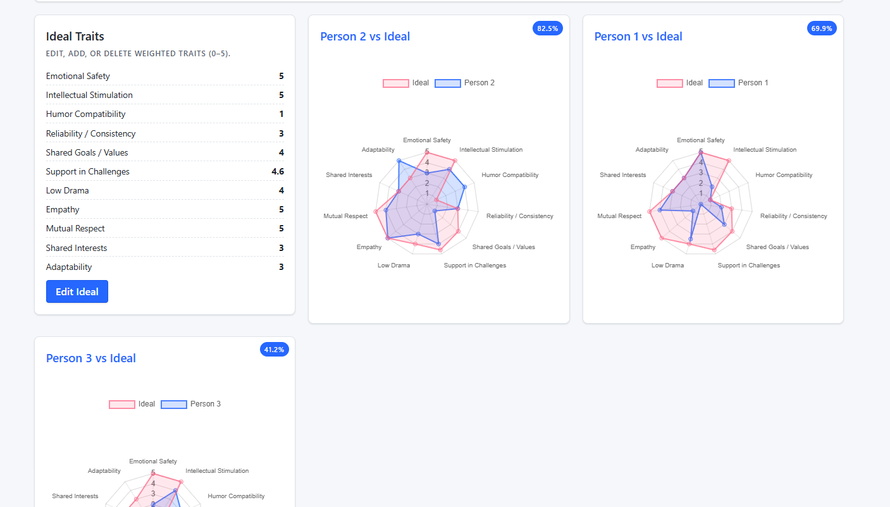
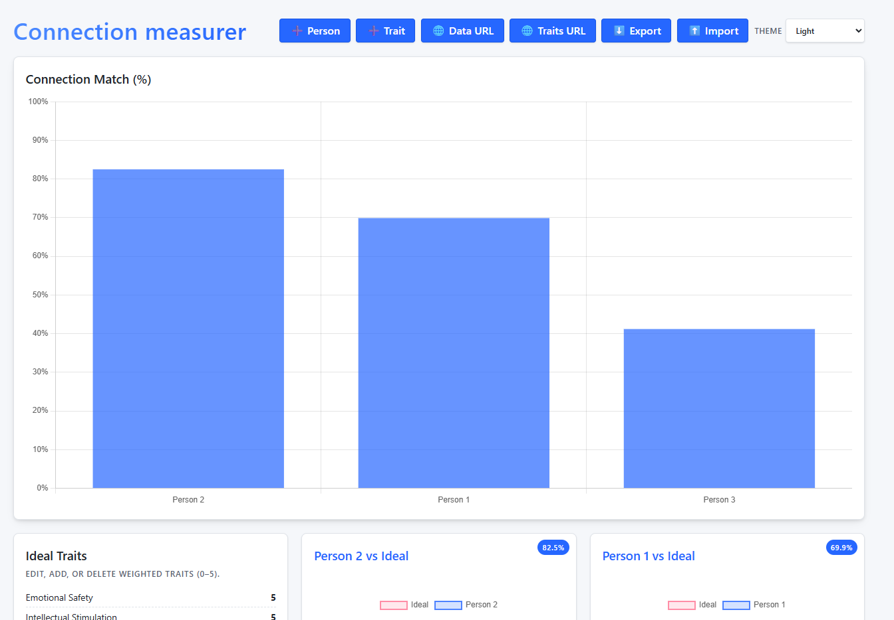
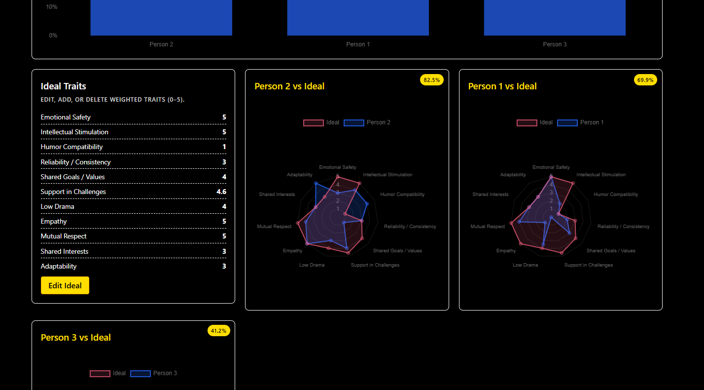

# Connection Measurer

Single‑page, client‑side tool to compare how different people align with an "Ideal" trait profile. No build step; pure HTML/CSS/JS + Chart.js.

## Features
- Responsive card + grid layout
- Single person deep link view using `?person=Name`
- Radar charts per person & overall match bar chart
- Editable Ideal traits (add / delete / reorder implicitly by recreation)
- Add people; edit their trait values inline
 - Add & delete people; edit their trait values inline
- Autocomplete trait suggestions (built‑in + persisted custom)
- Import remote data (merge or replace) and remote trait suggestion lists
- LocalStorage persistence (data, custom suggestions, theme)
- Theming: Light / Dark / High Contrast
- JSON export & import
- Accessible focus styles and semantic structure

## Screenshots
| Overview Grid | Overview | Themes |
| ------------- | ------------------------ | -------------- |
|  |  |  |

## Getting Started
1. Clone or download repository
2. Open `index.html` in any modern browser (Chrome, Firefox, Safari, Edge)
3. Start interacting (data persists locally)

No server required. All logic runs locally.

## Data Model
```
{
  "ideal": { "TraitName": number, ... },
  "people": [
    { "name": "Person 1", "traits": { "TraitName": number, ... } },
    ...
  ]
}
```
Trait values: 0–5 (decimals allowed). Match % = average over traits of min(person, ideal) / ideal * 100.

## Remote Data
- Data URL must return JSON with shape above
- Trait suggestion URL may return:
  - JSON array of strings
  - Plain text (newline separated)
  - JSON object with `traits: []`

## Theming
Stored in `localStorage` under key `connectionMatcherTheme`. High contrast uses black text on yellow accent for clarity.

## Key Shortcuts (Browser Prompts)
Currently add actions use prompts:
- Add Trait
- Add Person
Future enhancement: replace with modal dialogs.

## Export / Import
- Export: downloads `connection_matcher_data.json`
- Import: selects a JSON file (validated shape)

## Deep Linking
Open a single person: `index.html?person=Person%201`
Use the Back button in the UI to return to all.

## Persistence Keys
- `connectionMatcherData` – main dataset
- `connectionMatcherCustomTraits` – custom trait suggestions
- `connectionMatcherTheme` – selected theme

## Roadmap (Planned / Ideas)
- Modal forms (replace prompts)
- Manage & delete custom suggestions
- Trait weighting / advanced scoring
- System auto theme (prefers-color-scheme)
- Improved accessibility audit (ARIA labels per input)
- Chart color adaptation per theme
- Undo / history for edits
 - Bulk delete / reorder people

## Tech Stack
- Vanilla HTML5 / CSS3 / ES2023
- Chart.js 4.x (UMD CDN)
- No external build tooling

## Contributing
Open an issue or PR. Keep changes framework‑free and accessible.

## License
MIT (add LICENSE file if distributing publicly).
